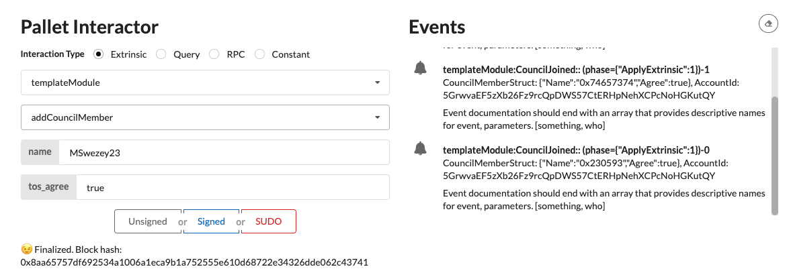

# [[INTERMEDIATE CHALLENGE] FRAME Development](https://gitcoin.co/issue/Polkadot-Network/hello-world-by-polkadot/7/100023933)

## Challenge 17 Completed

1. Custom Struct: 
   1. https://github.com/mswezey23/polkadot-hackathon/blob/master/node-template/pallets/template/src/lib.rs
2. Custom Types: 
   1. https://github.com/mswezey23/polkadot-hackathon/blob/master/front-end/src/TemplateModule.js
   2. https://github.com/mswezey23/polkadot-hackathon/blob/master/front-end/src/config/development.json

