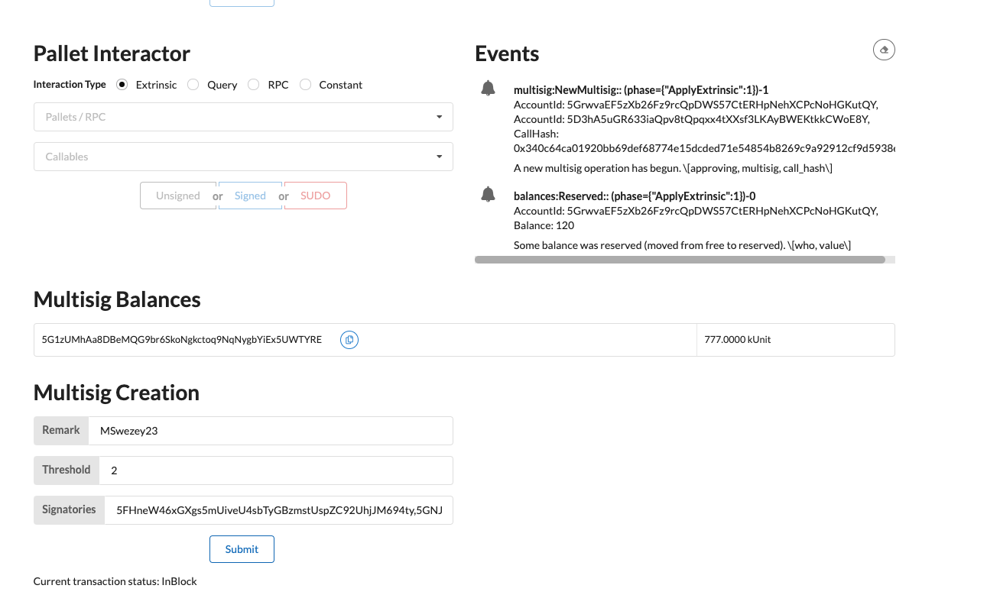

# [[INTERMEDIATE CHALLENGE] FRAME Multisig](https://gitcoin.co/issue/Polkadot-Network/hello-world-by-polkadot/8/100023934)

## Challenge 18 Completed

1. Multisig Pallet Impl: 
   1. https://github.com/mswezey23/polkadot-hackathon/blob/master/node-template/runtime/src/lib.rs
2. Front-end Components: 
   1. [Create Multisig](https://github.com/mswezey23/polkadot-hackathon/tree/master/front-end/src/Multsig.js)
   2. [Multisig Balances](https://github.com/mswezey23/polkadot-hackathon/tree/master/front-end/src/MultisigBalances.js)

## Instructions:
1. Send some coin to deterministic multisig address: `5G1zUMhAa8DBeMQG9br6SkoNgkctoq9NqNygbYiEx5UWTYRE`
2. Use multisig UI component to create multisig using bob & alice_stash's accounts (`threshold: 2`)
   1. `5FHneW46xGXgs5mUiveU4sbTyGBzmstUspZC92UhjJM694ty,5GNJqTPyNqANBkUVMN1LPPrxXnFouWXoe2wNSmmEoLctxiZY`
3. end result below

